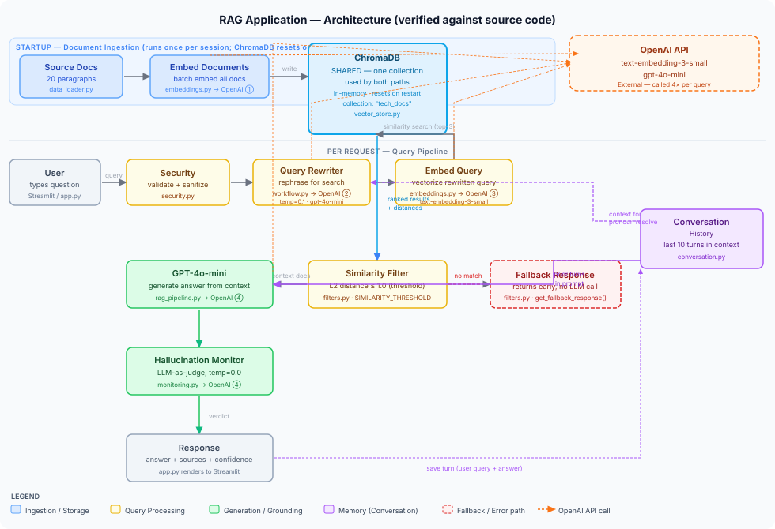

# RAG Application — Architecture



## Overview

This application is a Retrieval-Augmented Generation (RAG) system. Instead of relying solely on an AI model's training data, it retrieves relevant documents from a local knowledge base and uses those as context when generating answers. The result is more accurate, grounded responses.

---

## Components

### Document Ingestion (runs once at startup)

| Component | File | Role |
|-----------|------|------|
| Source Docs | `data_loader.py` | 20 pre-written text chunks covering Python, ML, databases, and AI |
| Embedding Service | `embeddings.py` | Converts each document into a numeric vector using OpenAI `text-embedding-3-small` |
| ChromaDB | `vector_store.py` | Stores document vectors so they can be searched by similarity |

At startup, all 20 documents are embedded and stored in ChromaDB. This only happens once per session.

---

### Query Pipeline (runs on every user question)

| Component | File | Role |
|-----------|------|------|
| User / Streamlit UI | `app.py` | Accepts the user's question through a chat interface |
| Security Validator | `security.py` | Checks for empty input, prompt injection attempts, and queries over 500 characters |
| Query Rewriter | `workflow.py` | Uses GPT-4o-mini to rephrase the question for better semantic search |
| Embed Query | `embeddings.py` | Converts the rewritten query into a vector |
| ChromaDB Search | `vector_store.py` | Finds the top-K most similar documents using cosine distance |
| Similarity Filter | `filters.py` | Drops documents that are too dissimilar (distance above threshold) |
| GPT-4o-mini | `rag_pipeline.py` | Generates an answer using the retrieved documents as context |
| Hallucination Monitor | `monitoring.py` | Uses a second LLM call to verify the answer is grounded in the source documents |
| Response | `app.py` | Displays the answer, sources, confidence score, and grounding verdict |

---

### Memory

| Component | File | Role |
|-----------|------|------|
| Conversation History | `conversation.py` | Stores recent turns so follow-up questions resolve correctly (e.g., "what else can *it* do?") |

The conversation history feeds into both the Query Rewriter (to resolve pronouns) and the generation prompt (so GPT-4o-mini has prior context).

---

## Data Flow

**Ingestion path** (top of diagram, blue):
```
Source Docs → Embedding Service → ChromaDB (stored)
```

**Query path** (middle and bottom, yellow → green):
```
User query
  → Security Validator (block injections)
  → Query Rewriter (improve phrasing)
  → Embed Query (vectorize)
  → ChromaDB (find similar docs)
  → Similarity Filter (drop weak matches)
  → GPT-4o-mini (generate answer with context)
  → Hallucination Monitor (verify grounding)
  → Response shown to user
```

**Memory path** (purple, bidirectional):
```
Conversation History ↔ Query Rewriter / Generation Prompt
```

---

## Tech Stack

- **Frontend**: Streamlit
- **LLM**: OpenAI GPT-4o-mini
- **Embeddings**: OpenAI text-embedding-3-small
- **Vector Store**: ChromaDB (local, in-memory)
- **Language**: Python 3.14
